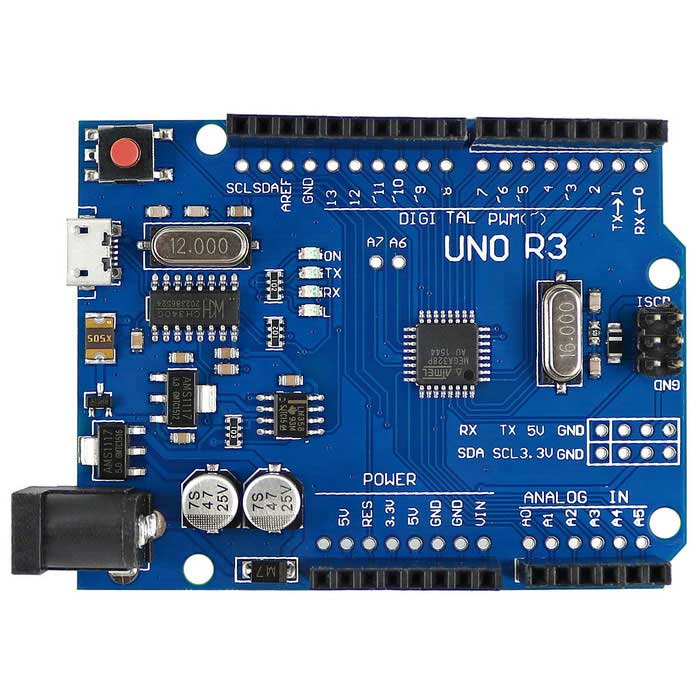
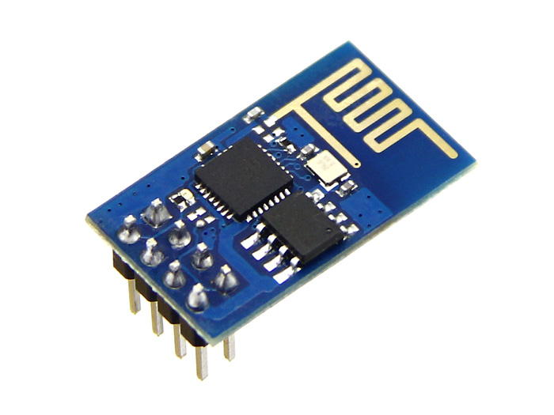
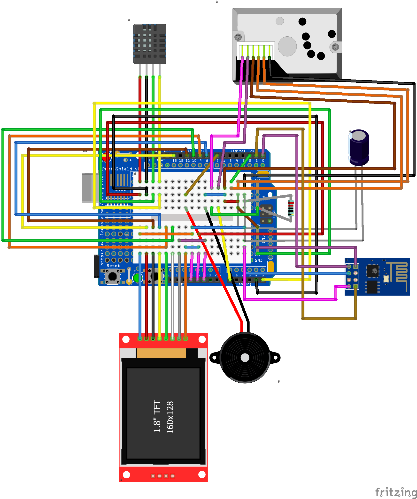

# PM25
<li>This is a Project for computer programming 06016315</li>
<li>これは、コンピュータ プログラミングの のプロジェクト 06016315</li>
<li>โปรเจคนี้ เป็นส่วนหนึ่งของรายวิชา คอมพิวเตอร์โปรแกรมมิ่ง 06016315</li>

# Abstract
&emsp;Because of the weather in the past to the present, we have experienced the air pollution is to Dust very small or called "PM2.5"
That affect the respiratory tract when inhaled, and can eat other diseases that followed The organizer made up by this project will bring Microcontroller took part, we create a Detect weather but of that the condition. How is the weather? A little dust can do in the open or not. The dust should stay indoors and wear a mask when you need to be in the open. 
 &emsp;過去から現在までの天候のため、私たちは、大気汚染が非常に小さいか、吸入されたときに呼吸器に影響を与える“PM 2.5”と呼ばれていることを経験したし、このプロジェクトによって構成された主催者に従って他の病気を食べることができる他の病気は、マイクロコントローラをもたらすもたらす、我々は検出の天気を作成するが、その条件の。天気はどうですか。少しのほこりは、開いているか、そうすることができません。あなたが開いている必要があるとき、ほこりは屋内にとどまって、マスクを着なければなりません。 
&emsp;เนื่องจากสภาพอากาศในอดีตส่งผลมาถึงปัจจุบันเราได้ประสบปัญหามลพิษทางอากาศ คือ การเกิดฝุ่นละอองขนาด เล็กมากหรือที่เรียกว่า "PM2.5" ที่ส่งผลกระทบต่อทางเดินหายใจเมื่อสูดดมเข้าไปและสามารถกิดโรคอื่นๆตามมาได้ ทางผู้จัดทำเลยทำโครงงานนี้ขึ้นมาโดยการจะนำ Microcontroller มามีส่วนร่วม โดยเราจะสร้างตัวตรวจจับ สภาพอากาศในแต่ล่ะแห่งว่ามีค่าสภาพอากาศเป็นอย่างไร มีค่าฝุ่นละอองน้อยสามารถทำกิจกรรมในที่โล่งแจ้งได้หรือ มีค่าฝุ่นละอองมากควรอยู่ภายในอาคารและสวมหน้ากากอนามัยเมื่อจำเป็นต้องอยู่ในที่โล่งแจ้ง 
# Required components 
<table>
<thead>
<tr>
<th align="center">SHARP GP2Y10 Dust Sensor PM2.5 module</th>
<th align="center">Arduino Uno R3</th>
<th align="center">Micro USB Arduino cable Micro</th>
<th align="center">AM2322 Aosong temperature sensor</th>
<th align="center">TFT LCD Size 1.4 [128*128] or Size 1.8 [128*160]"</th>
</tr>
</thead>
<tbody>
<tr>
<td align="center"></td>
<td align="center"></td>
<td align="center"></td>
<td align="center"></td>
<td align="center"></td>
</tr>
</tbody>
</table>
<table>
<thead>
<tr>
<th align="center">ESP8266 module</th>
<th align="center">Arduino uno ProtoShield Mini Breadboard PCB + Mini Breadboard</th>
<th align="center">Active Buzzer Module > 3.3 V</th>
<th align="center">Jumper cable</th>
</tr>
</thead>
<tbody>
<tr>
<td align="center"></td>
<td align="center"></td>
<td align="center"></td>
<td align="center"></td>
</tr>
</tbody>
</table>

# Board connection

# Library in use
<ul>
<li>SPI.h</li>
<li>Adafruit_GFX.h</li>
<li>TFT_ILI9163C.h</li>
<li>Adafruit_Sensor.h</li>
<li>Adafruit_AM2320.h</li>
<li>ESP8266WiFi.h</li>
 <li>FirebaseArduino.h</li>
</ul>

# Result
You can check the status online here. 
あなたはここにオンライン状態を確認することができます。 
สามารถเช็คสถานะออนไลน์ได้ที่นี่ 
<a href="https://fireboard.xyz/show--LddxE0YU3JoGkADjyL8.html">fireboard.xyz</a>
 

# Members
<table>
<thead>
<tr>
<th align="center"></th>
<th>Name 名称 ชื่อ</th>
<th>Surname 姓 นามสกุล</th>
<th>GitHub Username</th>
<th>Student ID number 学生の番号 รหัสนักศึกษา</th>
</tr>
</thead>

<tbody>
<tr>
<td align="center"></td>
<td>Nutnaree</td>
<td>Rueangkajorn</td>
<td><a href="https://github.com/sinennr">@sinennr</a></td>
<td align="center">61070050</td>
</tr>
<tr>
<td align="center"></td>
<td>Tiraphong</td>
<td>Nantapan</td>
<td><a href="https://github.com/ThinAstaroth">@ThinAstaroth</a></td>
<td align="center">61070090</td>
</tr>
<tr> 
<td align="center"></td>
<td>Wanasin</td>
<td>Muttasathean</td>
<td><a href="https://github.com/Trity2543">@Trity2543</a></td>
<td align="center">61070194</td>
</tr>
<tr>
<td align="center"></td>
<td>Wantana</td>
<td>Monlucksa</td>
<td><a href="https://github.com/it61070202">@61070202</a></td>
<td align="center">61070202</td>
</tr>
</tbody>
</table>

# Special thanks

<table>
<thead>
<tr>
<th align="center" href="Image/ksc.jpg"></th>
<th align="center" href="Image/pw.jpg"></th>
</tr>
</thead>
<tbody>
<tr>
<td align="center"> Asst Profressor Kitsuchart Pasupa ผศ. ดร. กิติ์สุชาต พสุภา</td>
<td align="center"> Asst Profressor Panwit Tuwanut ผศ. ดร. ปานวิทย์ ธุวะนุติ</td>
</tr>
</tbody>
</table>

Thank you for Attentions 注目いただきありがとうございます

<h2>Faculty of Information Technology 情報技術学部 คณะเทคโนโลยีสารสนเทศ</h2>

<h2> King Mongkut's Institute of Technology Ladkrabang モンクット王工科大学ラートクラバン校 สถาบันเทคโนโลยีพระจอมเกล้าเจ้าคุณทหารลาดกระบัง </h2> 
<a target="_blank" rel="noopener noreferrer" href="Image/it_kmitl_logo.jpg">
